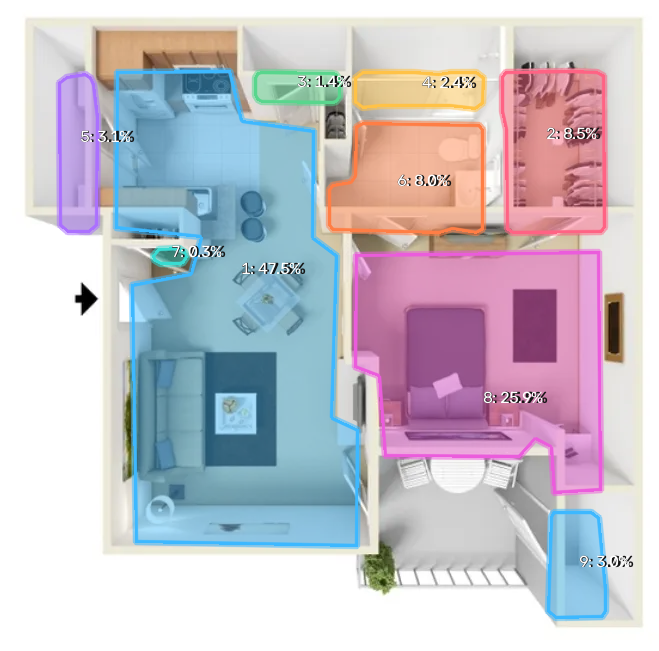
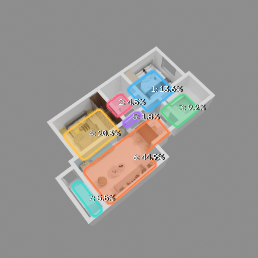

# Floor Plan Extractor

Extract room polygons and relative pixel areas from a single RGB image of a 3D floor plan.

## Approach

The RGB image is resized with aspect-ratio-preserving padding and normalized using ImageNet statistics. Depth Anything V2 provides a relative depth map, which is robustly normalized between its 1st and 99th percentiles. The resulting RGBD tensor is processed by a ConvNeXt-S backbone with a UPerNet segmentation head and a homography regression head.

$$
\begin{aligned}
D_n &= 2\,\mathrm{clip}\left(\frac{D-P_1(D)}{P_{99}(D)-P_1(D)},0,1\right)-1 \\
X &= \mathrm{concat}\left(\frac{I-\mu}{\sigma},D_n\right) \\
(F_1,F_2,F_3,F_4) &= \mathrm{ConvNeXtS}(X) \\
M_{top} &= \mathrm{sigmoid}\left(\mathrm{UPerNet}(F_1,F_2,F_3,F_4)\right) \\
H &= \mathrm{HomographyHead}(F_4) \\
M_{floor} &= \mathrm{warp}(M_{top},H)
\end{aligned}
$$

Room polygons are extracted from the projected mask using hysteresis thresholding, morphological closing, and short collinear-gap completion. The exterior is found by flood-filling free space from the image borders. The remaining enclosed connected components are simplified into room polygons.

$$
\begin{aligned}
W &= \mathrm{Morphology}\left(\mathrm{Hysteresis}(M_{floor},\tau_{weak},\tau_{strong})\right) \\
O &= \mathrm{FloodFill}_{\partial\Omega}(\neg W) \\
\{R_i\} &= \mathrm{ConnectedComponents}(\neg W \setminus O) \\
A_i &= |R_i|, \qquad r_i=\frac{A_i}{\sum_j A_j}
\end{aligned}
$$

## Assumptions

These are **<u>TEMPORARY</u>** limitations of the current prototype: wall surfaces are expected to have a color close to white, and the visible wall-cut plane is assumed to be parallel to the floor plane. Inputs that strongly violate either assumption may produce incomplete wall masks or geometrically inconsistent room polygons.

## Results

Additional inputs, intermediate masks, annotated images, and JSON outputs are available in [`examples/`](examples/).

<p align="center">
  
  
</p>

## Quickstart

Git LFS is required for the model checkpoint.

```bash
git lfs pull
docker compose up --build -d
```

Wait until the service is ready:

```bash
curl http://localhost:8000/health
```

Extract rooms from an image:

```bash
curl -X POST "http://localhost:8000/extract?preset=weak" \
  -F "image=@examples/test_2/input.webp" \
  -o result.zip

unzip result.zip -d outputs/test_2
```

The archive contains:

```text
annotated.png
probability.png
wall_barrier.png
rooms.json
```

The conservative post-processing preset is available with `preset=conservative`.
